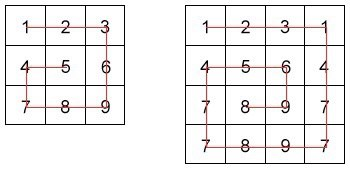

# Flattener

## Description :

Flattener converts two-dimensional slice in one-dimensional traversing it clockwise.

Example 1 :  
`input := [
[1,2,3],
[4,5,6],
[7,8,9],
]`  
`output := [1,2,3,6,9,8,7,4,5]`  

Example 2 :  
`input := [
[1,2,3,1],
[4,5,6,4],
[7,8,9,7],
[7,8,9,7],
]`  
`output := [1,2,3,1,4,7,7,9,8,7,7,4,5,6,9,8]`  

